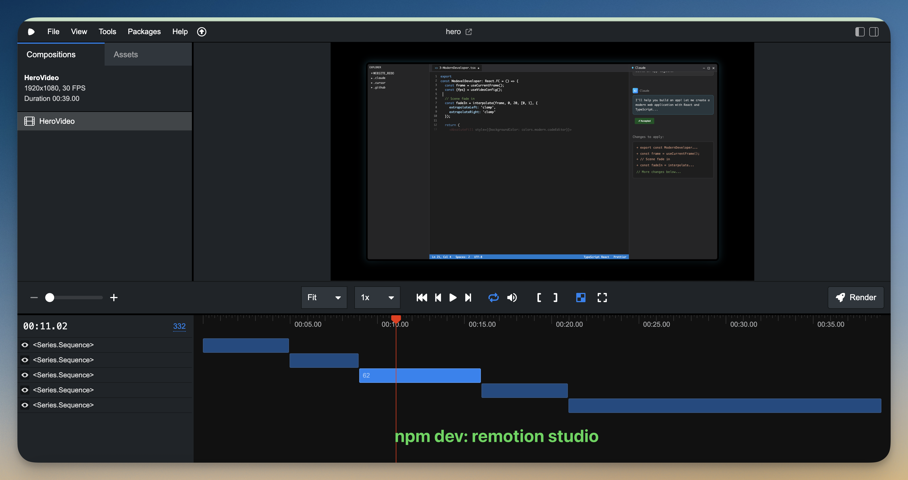

# From Zero to Product Video Hero: Build Your Own with Claude Code, Remotion and SpecStory!

## 🎬 **[Read the complete walkthrough of how this was built](https://get.specstory.com/build-product-video-with-ai)**

This the source code and SpecStory conversation history for a hero animation video built with [Remotion](https://www.remotion.dev/) that showcases the evolution from traditional development to modern AI-assisted development. The project demonstrates how AI tools like Claude, Copilot, and Cursor are transforming the developer experience and how [SpecStory helps you save your conversation history](https://get.specstory.com/extension).

## See It In Action

### ▶️ Watch on YouTube
Click the image below to watch the 39-second animated video that tells the story of how capturing our intent in software development has evolved from medieval scribes to modern AI-powered development.

[](https://www.youtube.com/watch?v=0mTtPDFm5_I)
*🎥 Click to play on YouTube*

The animation features:

- A medieval developer transitioning through time
- Modern IDE interfaces with AI assistants
- Visual metaphors for the transformation in coding
- Professional motion graphics and transitions

## Running the Project

### Prerequisites

- Node.js 18+ 
- npm or yarn

### Installation

First, navigate to the hero directory and install dependencies:

```bash
cd hero
npm install
```

### Development

To preview the video in development mode:

```bash
npm start
```

This will open the Remotion Studio where you can:
- Preview all scenes
- Adjust timing and parameters
- Export individual frames



### Building the Video

To render the final video:

```bash
npx remotion render src/index.tsx HeroVideo out/HeroVideo.mp4 \
  --quality=100 \
  --fps=30 \
  --crf=16 \
  --pixel-format=yuv444p
```

This will output the video to `out/HeroVideo.mp4`

## Project Structure

```
zero-to-product-video-hero/
├── hero/                       # The Remotion animation project
│   ├── src/
│   │   ├── HeroVideo.tsx      # Main video composition
│   │   ├── HeroAnimation.tsx  # Animation component
│   │   ├── index.tsx          # Entry point
│   │   ├── scenes/            # Individual animated scenes
│   │   │   ├── 0-VideoIntro.tsx
│   │   │   ├── 2-TimeTransition.tsx
│   │   │   ├── 3-ModernDeveloper.tsx
│   │   │   ├── 4-IntentOverlay.tsx
│   │   │   └── 5-BenefitsAndLogos.tsx
│   │   ├── components/        # Reusable animation components
│   │   │   ├── AIAssistant.tsx
│   │   │   ├── CandleGlow.tsx
│   │   │   ├── CodeEditor.tsx
│   │   │   ├── ModernIDE.tsx
│   │   │   ├── Parchment.tsx
│   │   │   ├── ParticleEffect.tsx
│   │   │   └── Quill.tsx
│   │   └── styles/
│   │       └── design-tokens.ts
│   ├── public/                # Assets
│   │   ├── intro.mp4
│   │   ├── modern.mp4
│   │   ├── time tunnel.mp4
│   │   ├── claude.svg
│   │   ├── copilot.svg
│   │   ├── cursor.svg
│   │   ├── specstoryicon.png
│   │   ├── specstorylogo.svg
│   │   └── specstorylogo-inverted.svg
│   ├── out/                   # Rendered outputs
│   │   ├── HeroVideo.mp4
│   │   └── *.gif             # Scene GIFs
│   ├── package.json
│   ├── tsconfig.json
│   └── README.md
├── plan.md                    # Original video script/plan
├── 2025-07-28_16-59-14Z-in-at-my-app.md         # Build chat history 1
├── 2025-07-28_20-14-15Z-chat-history-to-build-remotion.md  # Build chat history 2
├── example/                   # Another Remotion example project I had created for tny.dev that helped me bootstrap this one
└── README.md                  # This file
```

## How This Was Built

This project was built entirely through AI-assisted development with Claude Code, demonstrating the very workflow it portrays. The complete build process is documented in these chat histories:

- **Initial Build Session**: [2025-07-28_16-59-14Z-in-at-my-app.md](./2025-07-28_16-59-14Z-in-at-my-app.md)
- **Extended Development**: [2025-07-28_20-14-15Z-chat-history-to-build-remotion.md](./2025-07-28_20-14-15Z-chat-history-to-build-remotion.md)

### Starting Point

The initial plan for this video is documented at [plan.md](./plan.md), which outlines the scene-by-scene script for the SpecStory hero animation. This plan served as the blueprint for creating a 35-second video (which became 39 seconds) that tells the story of how developers have always preserved intent - from medieval scribes to modern AI-assisted development.

## Tech Stack in this repo

- **Remotion**: React-based video creation framework
- **TypeScript**: Type-safe development
- **React**: Component-based animations
- **Tailwind CSS**: Utility-first styling

The full tech stack used to create everything here is documented extensively

➡️ [Read the complete walkthrough of how this was built](https://get.specstory.com/build-product-video-with-ai)

Some other products used in its creation include:

- Gamma.app
- Midjourney
- Veo 3 (via Flow)
- Capcut

## Key Features

- Smooth scene transitions
- Particle effects and animations
- Custom animated components (quill, parchment, candle effects)
- Modern glassmorphism UI elements
- Professional timing and pacing

## License

This project is licensed under the MIT License - see the [LICENSE](LICENSE) file for details. Feel free to fork and create your own AI-powered animations!

---

Built with ❤️ and copious Claude Code assistance
